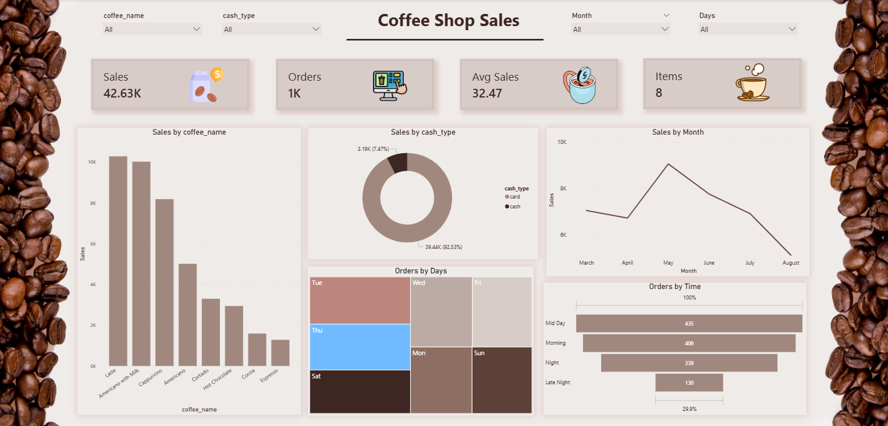

# ☕ Coffee Shop Sales Analysis Dashboard

## 📌 Overview
This Power BI dashboard provides insights into coffee shop sales performance, customer purchasing behavior, and payment preferences through interactive visualizations and KPIs.

## 🛠 Tools Used
- Power BI
- Power Query
- DAX
- Data Modeling

## 📊 Key Metrics
- Total Sales
- Total Orders
- Average Sales per Order
- Number of Items Sold

## 📈 Dashboard Insights
- Latte and Americano with Milk generated the highest sales.
- Card payments accounted for over 90% of transactions.
- Sales peaked during May and declined toward August.
- Midday recorded the highest number of orders.
- Customer demand varied significantly across weekdays.

## 📷 Dashboard Preview

## 🚀 Project Goal
Transform raw coffee shop transaction data into actionable business insights using Power BI.
